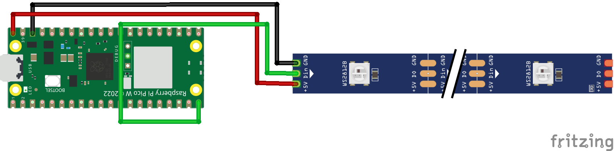
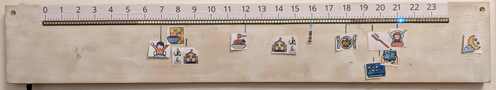

# ntpstrip: display ntp time on a led strip

Inspired by [hometime](https://github.com/veebch/hometime),
and using the
[same hardware](https://github.com/veebch/hometime?tab=readme-ov-file#hardware),
but with much simpler software.

## Hardware

* Raspberry Pi Pico W
* 5V Addressable LED strip: WS2812B Eco, 1m, 144 LEDs

## Finished Product

## Comparison with hometime

|                                          | [hometime](https://github.com/veebch/hometime) | **ntpstrip** |
|------------------------------------------|------------------------------------------------|--------------|
| Shows Google Calender events             | ✅                                             | ❌           |
| Time source                              | https://timeapi.io                             | NTP: pool.ntp.org |
| Timezone + DST support                   | https://timeapi.io                             | [localPTZtime](https://github.com/bellingeri/localPTZtime) |
| Display mode                             | Progress bar                                   | Single dot   |
| Time range                               | Workday (configurable)                         | Full 24h (fixed)  |
| Wifi config                              | Temporary access point + webform               | config.py    |
